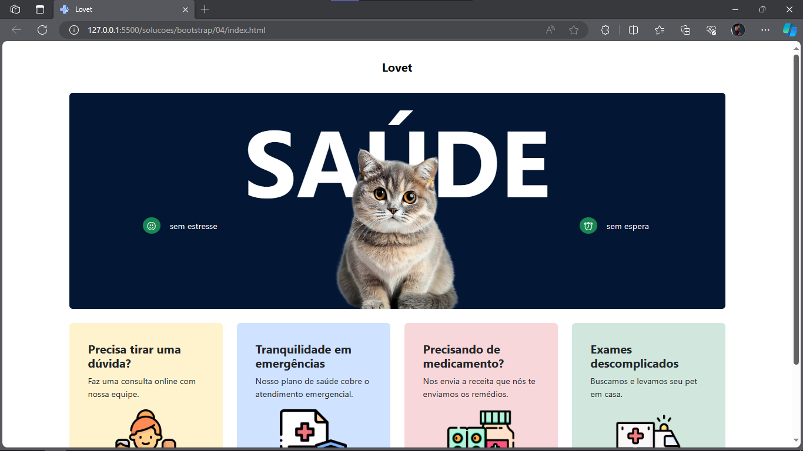

# Exercício 04 de Bootstrap

## 📝 Descrição

Esse projeto é um pouquinho (só um pouquinho mesmo 🤏🏻) mais difícil do que os que fizemos até agora. Nós vamos criar uma landing page beeeeeeem simples para um petshop fictício. Ela é composta por cards e você pode ver o projeto da telinha no [Figma](https://www.figma.com/file/CIMG6UTbmxmt2pQAjxesfT/Exerc%C3%ADcio-04-de-Bootstrap?type=design&node-id=0%3A1&mode=dev).

## 📑 Passo a passo

1. Crie a estrutura básica no arquivo [`index.html`](./index.html), adicione os links do CSS e do Javascript do Bootstrap e mude o título da sua página para "Lovet";

2. Adicione a navbar abaixo e personalize-a de acordo com o modelo do Figma

   ```html
   <nav class="navbar">
     <div class="container">
       <a class="navbar-brand fw-bold mx-auto" href="#">Lovet</a>
     </div>
   </nav>
   ```

3. Mude a fonte do seu site para [Montserrat](https://fonts.google.com/specimen/Montserrat) disponível gratuitamente no Google Fonts.

4. Substitua o favicon da página pelo disponibilizado na pasta [`assets`](./assets/);

5. Crie duas linhas na seguinte disposição:

   - a primeira linha deve possuir um único card que ocupe a tela inteira;

   - a segunda linha deve possuir 4 cards, todos com a mesma largura.

   > ⚠ _importante: lembre-se de atentar-se à responsividade dos cards_

6. Modifique as cores do plano de fundo de cada card usando como referência o arquivo figma disponibilizado na [📝 Descrição](#📝-descrição) e a [documentação do Bootstrap sobre backgrounds](https://getbootstrap.com/docs/5.3/utilities/background/#background-color).

   > 🧩 _dica: mexer na opacidade de uma cor pode deixá-la mais clara_

7. Adicione o Bootstrap Icons ao projeto.

    > 🧩 dica: você irá utilizar os icons emoji-smile e alarm

8. Use a [documentação do Bootstrap sobre Position](https://getbootstrap.com/docs/5.3/utilities/position) para posicionar os elementos do card principal.

9. Use os conhecimentos adiquiridos até agora para posicionar os elementos dos 4 cards menores.

Ao final desse passo-a-passo, sua página deve ter mais ou menos a seguinte aparência:



## ➕ Atividade extra

> Para quem quer se aprofundar no conteúdo.

1. Ler a [documentação do CSS sobre position](https://developer.mozilla.org/en-US/docs/Web/CSS/position).

2. Resolver os [exercícios de CSS da w3schools](https://www.w3schools.com/css/exercise.asp?filename=exercise_positioning1).

## ✉ Contato

Se você tiver alguma dúvida ou precisar de assistência adicional, sinta-se à vontade para entrar em contato comigo em [liviaraianen@gmail.com](mailto:liviaraianen@gmail.com).

Bons estudos! 💜
